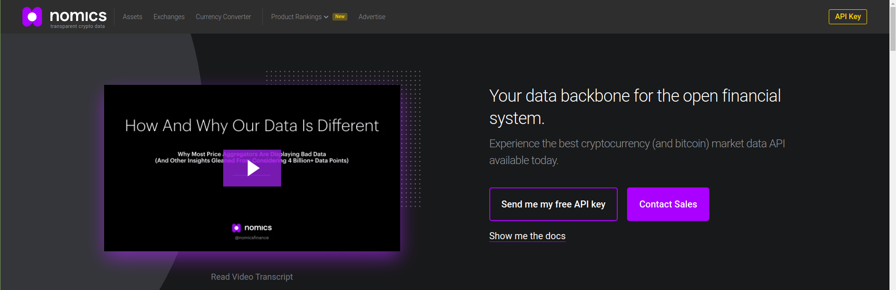
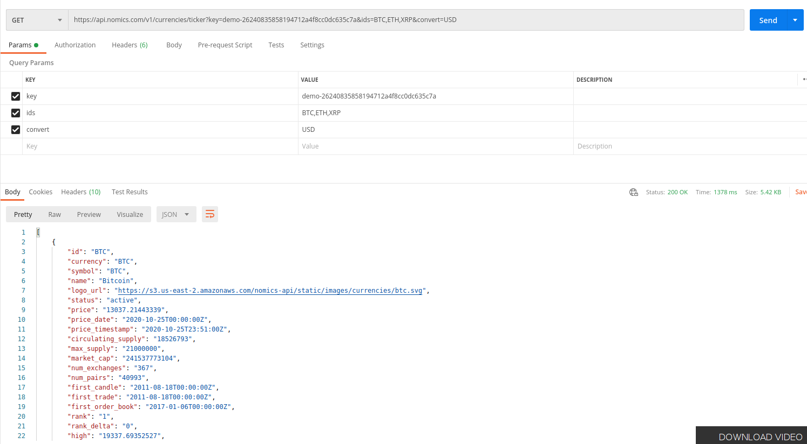

# Nodejs cli for crypto currency

[Tutorial](https://www.youtube.com/watch?v=-6OAHsde15E)

 - __https://nomics.com/__ visit this site for getting free api for crypto currency
 - Click on api key and enter email address it will send the key via email

 

 - The complete solution for node.js command-line interfaces, inspired by Ruby's commander. `npm i commander`
 - A collection of common interactive command line user interfaces. `npm i inquirer`
 - The config is stored in a JSON file located in $XDG_CONFIG_HOME or ~/.config.
Example: *~/.config/configstore/some-id.json* `npm i configstore`
 - Setup **bin** from **package.json** `{ "bin" : { "myapp" : "./cli.js" } }` [know more](https://docs.npmjs.com/files/package.json#bin) 
 - Please make sure that your file(s) referenced in bin starts with #!/usr/bin/env node, otherwise the scripts are started without the node executable!
 - Link.js is a module loader and conversion tool. It supports Labeled Modules, CommonJS and Asynchronous Module Definitions (AMD). `sudo npm link` 


# Using Coindex cli 

 - Run `coindex` from anyware in the terminal
 - Get an array of path and arguments `coindex key`
 - `coindex key set` **set** is third parameters
 - `coindex --help` It will show all help commands
 - *Sub lavel commands* `coindex key` and `coindex key set`
 - Making two more sub commands `coindex key show` and ``coindex key remove``
 - User input key `coindex key set` with required validation
 - Remove key and show `coindex key remove` and `coindex key show`
 
### Working with crypto currency api

 - `coindex check price` check price of coin
 - `coindex check price --coin=BTC --cur=EUR` getting specific currency format
 - get request sample from  nomics documentation -> standard -> [currencies](http://docs.nomics.com/#tag/Currencies) and check it with postman

```
https://api.nomics.com/v1/currencies/ticker?key=demo-26240835858194712a4f8cc0dc635c7a&ids=BTC,ETH,XRP&convert=USD
```

 

 - `coindex check price` check crypto currency prices using nomics api
 - `coindex check price --cur=EUR` format as euro
 - `coindex key set` set invalid random api and check that api `coindex check price` it will show custom error